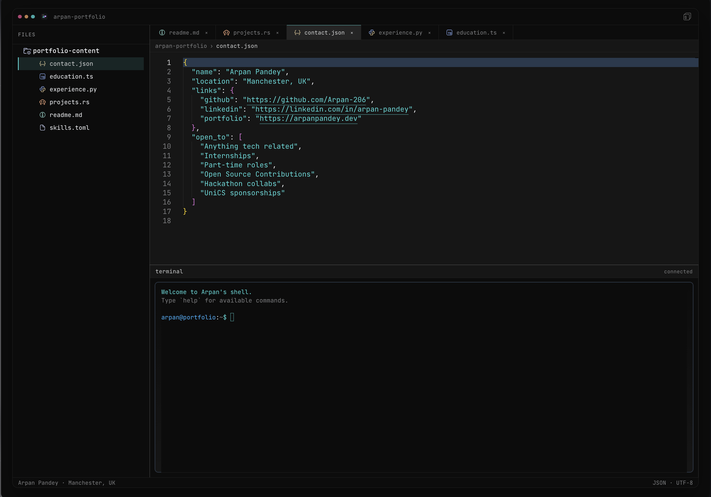

# IDE-Portfolio

Interactive developer portfolio with a **Rust WASM terminal** and a **Zed-inspired UI**.

**Live demo**: [arpanpandey.dev](https://arpanpandey.dev)

## ✨ Features

- **Rust WASM Terminal** — Live shell in the browser (xterm.js + Rust WASM, tab completion)
- **Monaco Editor** — VSCode engine with syntax highlighting
- **Markdown Preview** — Split view for `.md` files
- **Live File Tree** — Renders `src/portfolio-content/`
- **Zed-Style Layout** — Allotment splits + custom theme
- **Multi-file Portfolio** — JSON/RS/Python/TS/TOML content

## 🛠 Tech Stack

- **Frontend**: Next.js, React, TypeScript, Tailwind CSS
- **Editor**: Monaco Editor
- **Terminal**: xterm.js + Rust WASM backend
- **Layout**: Allotment
- **State**: Zustand
- **Tooling**: Bun, Biome

## 📁 Portfolio Structure (`src/portfolio-content/`)

```
readme.md          ← Personal overview
contact.json       ← Links + availability
projects.rs        ← Projects list
experience.py      ← Work experience
education.ts       ← Education + certifications
skills.toml        ← Skills matrix
```

## 🚀 Quickstart

```
git clone https://github.com/Arpan-206/IDE-Portfolio.git
cd IDE-Portfolio
bun install
bun dev
```

**Local**: `http://localhost:3000`

## 🧪 Development

```
# Add new portfolio file
echo "# Skills" > src/portfolio-content/new-skills.md

# Regenerate content (auto on dev)
bun script/generate.js

# Build Rust WASM bundle
just wasm-build

# Lint / format
bun run lint
bun run format
```

## 📱 Screenshots



## 🎯 Why This Exists

Traditional portfolios are static. This one is an **interactive IDE** that showcases real code and tooling.

- **Recruiters** see a live terminal + structured content
- **Collaborators** browse real data structures
- **You** ship a real product (Rust WASM + Next.js)

## 🤝 Contributing

1. Fork → edit `src/components/` or `src/portfolio-content/`
2. Run `bun run lint`
3. Open a PR with screenshots

## 📄 License

© 2026 Arpan Pandey. Licensed under [CC BY-SA 4.0](https://creativecommons.org/licenses/by-sa/4.0/).

[](https://creativecommons.org/licenses/by-sa/4.0/)
